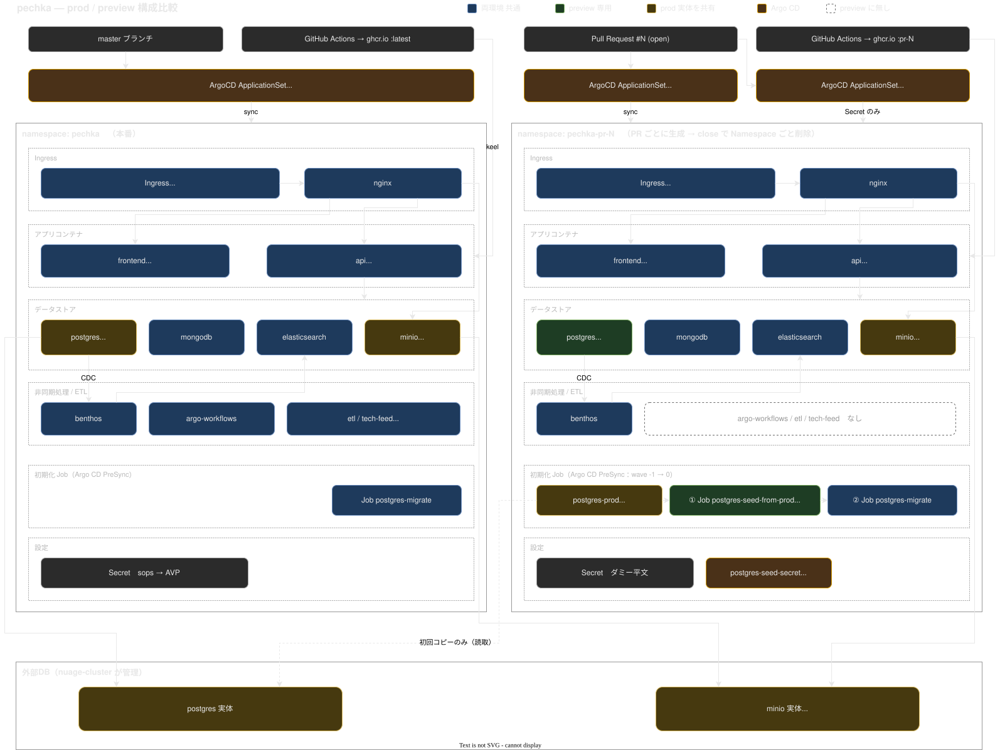

# preview 環境

open な PR 1本につき 1環境を `pechka-pr-<N>` namespace に自動で立ち上げる。
PR を立てれば生え、close/merge すれば namespace ごと消える。

- URL: `https://pechka-pr-<N>.wpcapp.net`
- VRT レポート: `https://pechka-pr-<N>.wpcapp.net/vrt-report/index.html`

---

## 補足（図から読み取れないこと）

### Application を2つに分けている理由

ArgoCD の `kustomize.namespace` / `images` / `patches` によるネイティブ上書きは、CMP (plugin) を使う Application では効かない。
一方で prod の実 credential は sops 暗号化されており AVP が要る。
そこで **AVP が必要な `postgres-seed-secret` 1個だけを別 Application に切り出し**、本体はネイティブ kustomize のままにしている。
ArgoCD 側の CMP 設定 (`avp-cmp-plugin.yaml`) には手を入れていない。

### PRごとに書き換わる値

この overlay 内はダミー値で、`nuage-cluster/manifests/apps/pechka-preview-appset.yaml` が上書きする。

| 対象 | この overlay | 上書き後 |
| :-- | :-- | :-- |
| Namespace | `pechka-preview` | `pechka-pr-<N>` |
| image | `pechka-api` / `pechka-frontend` | `:pr-<N>` |
| Ingress host / tls | `DUMMY` | `pechka-pr-<N>.wpcapp.net` |

---

## 運用メモ

- 環境が立たないときは、まず `pechka-pr-<N>` と `pechka-pr-<N>-secret` の**両方**の Application があるか見る。Secret 側が無いと seed Job が PreSync で止まる。
- PR 検知は最大180秒間隔。イメージのビルドが終わるまで api/frontend は ImagePullBackOff になるが、CI 完走後に解消する。
- DB を prod の最新に取り直したいときは、該当 Application を Sync し直せばよい（seed Job は `BeforeHookCreation` で作り直される）。
- minio は prod と共有なので、**preview からの書き込みは prod のバケットに入る**。破壊的な変更を載せる PR では注意する。
