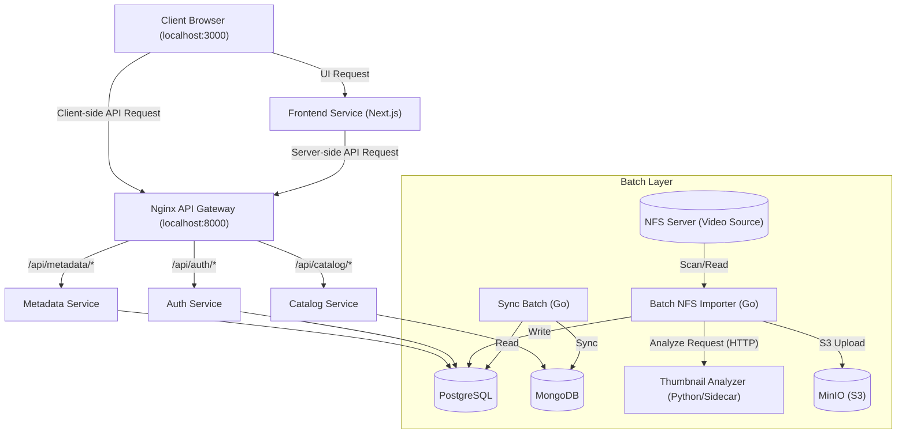

# マルチコンテンツ・ストリーミングサービス システムアーキテクチャ設計書 (Architecture Design)

本ドキュメントでは、`requirements.md` で定義された要件を満たすための具体的なシステム構成、データベース設計、およびインフラ構成を定義する。

## 1. 全体アーキテクチャ (System Landscape)

システム全体の基本方針は**「マイクロサービス化」**と**「API Gatewayパターン」**の採用。
現在は開発環境において、UIを `localhost:3000`、API Gateway(Nginx)を `localhost:8000` で提供するハイブリッド構成をとっている。

### Data Flow (Development)
1.  **UI表示**: ブラウザから `localhost:3000` にアクセス。
2.  **Server-side Fetch**: Next.js サーバーが内部ネットワーク経由 (`http://nginx:80`) でAPI Gatewayを叩き、カタログ情報を取得。
3.  **Client-side Fetch**: ブラウザ（hls.js や 管理画面モーダル）が `localhost:8000` を経由して各APIや動画アセットを取得。
4.  **CORS**: Nginx Gatewayが `localhost:3000` からのリクエストを許可するヘッダーを付与。

## 2. サービス設計詳細

### 2.1 Auth Service (認証・認可)
- **役割**: エンドユーザーの登録、ログインセッション管理（JWT発行・検証）、およびAdminユーザーの権限管理を担う。
- **データストア**: PostgreSQL (ユーザーテーブル、セッショントークンテーブル等)
- **設計方針**: パスワードのハッシュ化(bcrypt)、JWTによるステートレスな認証機構。将来的にはOAuth等の外部認証プロバイダ追加も視野に入れる。

### 2.2 Metadata Service (メタデータ管理API)
- **役割**: 映像作品(Title)、エピソード、ジャンル、タグなどのマスターデータ(CRUD)と、アセットパス(S3バケットキー)を管理する。
- **データストア**: PostgreSQL (リレーショナル・トランザクション処理)
  - **Short ID (表示用ID)**: Snowflake IDを用いて生成され、クライアントへのレスポンスやURL(例: `/title/7214567890`)で使用される。分散環境での一意性と順序性を両立する。
- **同期処理 (Sync Strategy A - 同期呼出し)**:
  - Adminからのメタデータ更新（INSERT/UPDATE）処理完了時、Metadata ServiceはCatalog Serviceの「データ同期用API」を内部呼び出し(HTTP/gRPC)し、即座に更新を反映させる。
  - シンプルさを重視し、まずは非同期MQ(RabbitMQ等)は導入せず、同期によるAPI連携で開始する。

### 2.3 Catalog & Search Service (カタログ・検索API)
- **役割**: エンドユーザー（フロントエンド）向けの参照特化型API。画面描画に最適化されたペイロードを最速で返却する。
- **データストア**: MongoDB
- **設計方針**:
  - `MongoDB` へのRead: 各作品情報(Titles, Genres, Assetsパス等)を非正規化した一つのドキュメントとして保持し、結合クエリを排除。画面描画に必要なデータは MongoDB からミリ秒単位で返却する。

### 2.4 インフラ・配信層 (CDN & Object Storage)
- **コンテンツ・画像管理**: アプリケーションサーバーやローカルディスクは利用せず、**MinIO (S3互換・セルフホスト可能)** を利用する。
- **高速配信**: 画像とHLSセグメントファイル(`.ts`, `.m3u8`)はCDNエッジでキャッシュ。アプリケーションバックエンドにはアクセスさせず、シーク・ローディング時のレイテンシを極小化する。

### 2.5 Batch Services & Sidecars
- **Batch NFS Importer (Go)**: NFS上のHLSファイルをスキャンし、MinIOへのアップロードとメタデータ登録を行う。
- **Thumbnail Analyzer (Python/FastAPI)**: Importerから呼び出されるサイドカーコンテナ。動画の輝度・音量などの重い解析ロジックを担当。
- **Sync Batch**: PostgreSQLのマスターデータ（Write系）を MongoDB（Read系）へ同期するプロセス。

- **設計方針**: 解析などのリソース消費が激しい処理や、Pythonのエコシステム（AI/画像処理）を活用したい処理をサイドカーとして分離することで、メインのバッチ処理の安定性と拡張性を確保する。また、書き込み系（RDB）と参照系（NoSQL）を分離するCQRS構成において、同期漏れを補完するための結果整合性をバッチ処理によって担保する。

## 3. データベーススキーマ設計方針 (PostgreSQL)

以下に代表的なテーブルの概要（UUIDとShortIDの分離を考慮した形）を示す。

**`users` (認証用: Auth Service管轄)**
- `id` (UUID, PK)
- `email`, `password_hash`, etc.

**`contents` (全コンテンツ共通のベーステーブル: Metadata Service管轄)**
全てのドキュメントに共通する「ID」「タイトル」「公開状態」などの基本情報を管理する。
- `id` (UUID, PK) - 内部リレーション用
- `short_id` (String, Unique, Indexed) - **【外部公開用】**(Snowflake ID)
- `content_type` (Enum: `video`, `image_gallery`, `ebook`...) - 子テーブルの種別判定用
- `title` (String) - タイトル名
- `description` (Text) - あらすじや説明
- `published_at` (Timestamp)
- `created_at`, `updated_at`

*(※ パフォーマンスと型安全を確保するため、コンテンツ種別ごとに専用の子テーブルを切る「Class Table Inheritance」パターンを採用する)*

**`content_videos` (動画固有データ: Metadata Service管轄)**
- `content_id` (UUID, PK, FK to `contents.id`)
- `is_360` (Boolean)
- `duration_seconds` (Int)
- `director` (String)

*(※ 今後、ネットワーク速度に応じた動的解像度対応(ABR)の導入を検討。その際はマスタープレイリスト等を用いた構成となる。)*

**`assets` (実体ファイル管理テーブル: Metadata Service管轄)**
1つのコンテンツに複数のアセット(動画マニフェスト、ポスター、PDF等)が紐づく。
- `id` (UUID, PK)
- `content_id` (UUID, FK to `contents.id`)
- `asset_role` (VARCHAR)
- `s3_key` (String) - MinIOオブジェクトキー

### 3.2 データベース間のスキーマ整合性 (PostgreSQL -> MongoDB)

- **MongoDBのスキーマ設計方針**:
  - PostgreSQLのような正規化（ベーステーブル＋専用テーブル＋アセットテーブル）を**そのままMongoDBに持ち込まない**。
  - Mongoの最大の強みである「1回のREADで画面描画に必要な全データを取得する」形（非正規化）にする。
  - したがって、Mongo側の `ContentCatalog` コレクションは「PostgreSQLの `contents` + `content_videos` + `assets` をあらかじめJOINして作られた単一の大きなJSONドキュメント」となる。

*(Catalog ServiceはMongoの1つのドキュメントを読むだけで、UIが必要とする「タイトル」「動画再生時間」「HLSパス」「ポスター画像パス」のすべてを取得できる)*

---

## 4. データ同期基盤 (Data Synchronization)

CQRSアーキテクチャにおける PostgreSQL(Write) と MongoDB(Read) のデータ整合性を担保するため、**Redpanda Connect (Benthos)** を用いた「チェックポイント方式」の非同期ポーリング同期を採用している。

- **仕組み**:
  - Benthos が PostgreSQL の `content_sync_view` を 10 秒間隔でポーリングする。
  - 最後に処理したデータの `updated_at` を PVC上のファイル (`/data/last_sync`) に記録（チェックポイント）し、次回のポーリング時はその時刻以降の差分のみを取得する。
  - 取得したデータを JSON オブジェクト構造に変換し、MongoDB へ `replace-one` (Upsert) で書き込む。
- **メリット**: 中間ミドルウェア（Kafka等）を持たないため運用が極めてシンプルであり、障害時はチェックポイントファイルを削除するだけで全量再同期が可能。

### 4.1 現在の技術的負債と将来の課題 (Technical Debt)

初期フェーズのMVPとしてシンプルさを優先した結果、将来的なデータ量増大や機能拡張に向けて以下の技術的負債・課題が存在する。

1. **ドメインモデルの型妥協 (`_id` の文字列化)**
   - MongoDB ドライバの挙動と Benthos のバイナリ出力の不整合を回避するため、現状 Go 側の `CatalogContent` 構造体の `ID` を `uuid.UUID` から `string` にダウンキャストしている。将来的に Benthos の BSON バイナリ出力設定を洗練させるか、Go ドライバレベルでの透過的なデコード処理を確立し、ドメインモデルの型安全性を回復する必要がある。
2. **トランザクション・コミット遅延による取りこぼしリスク**
   - 実行時間の長いトランザクションがコミットされた際、ポーリングのチェックポイント時刻を過去の `updated_at` がすり抜けてしまい、一時的な同期漏れが発生する可能性がある。将来的には Postgres の WAL を購読する CDC (Debezium等) の導入や、ポーリング時刻に手戻りのマージン（数分程度のオーバーラップスキャン）を持たせる改修が必要。
3. **完全置換 (`replace-one`) による拡張性の阻害**
   - 現在 MongoDB への同期はドキュメントの完全置換で行っている。今後「動画の再生回数」や「レコメンド用の学習スコア」など、Catalog側の MongoDB だけで独立して管理したいデータが生まれた場合、Postgres からの定期同期によってそれらが上書き・初期化されてしまう。出力処理を `$set` を用いた部分更新 (`update-one`) に変更する必要がある。
4. **チェックポイント揮発時の全スキャン負荷**
   - Kubernetes の PVC が消失しチェックポイントがリセットされた場合、Postgres から MongoDB へ全レコードが一気に再同期される。データ量が数十万件規模になった場合、システム全体に深刻な負荷スパイク（CPU/メモリ枯渇）を引き起こすため、クエリの `LIMIT` によるチャンク化や全量初期ロード専用バッチの分離が求められる。

---

## 5. 今後検討すべきアーキテクチャ (Future Considerations)

初期フェーズから作り込むとオーバースペックになるため一旦見送るが、中長期的に必要となるメジャーな技術要素。

- **全文検索エンジン (Elasticsearch 等)**
  - 現在はMongoDBのフルテキスト検索機能を用いる想定だが、データ量増加時や「表記ゆれ」「サジェスト」機能が求められた場合は専用のSearch Engineへと同期する戦略が必要。
- **コンテンツ種別の動的拡張**
  - 現在の Video, Image, 360VR 以外にも、ドキュメント(PDF)や音声(Audio)など、配信対象を広げられる設計を維持する。
- **メッセージキュー (Event Driven Architecture)**
  - 上記の「PostgreSQL -> MongoDB -> Elasticsearch」という段階的な同期を同期APIやBatchに頼るのが苦しくなったフェーズでは、RabbitMQやKafkaといったメッセージブローカーを導入。デッドレターキュー(DLQ)を用いた確実なイベント配信基盤(Event Sourcing/CQRS)へと進化させる。
- **論理削除 (Soft Delete)**
  - コンテンツを誤って削除した場合の復旧手段。RDB上で `deleted_at` カラムを持つ。この際、MinIO上の数十GBのHLSファイル等の物理削除のタイミングをどう設計するかが論点となる。
