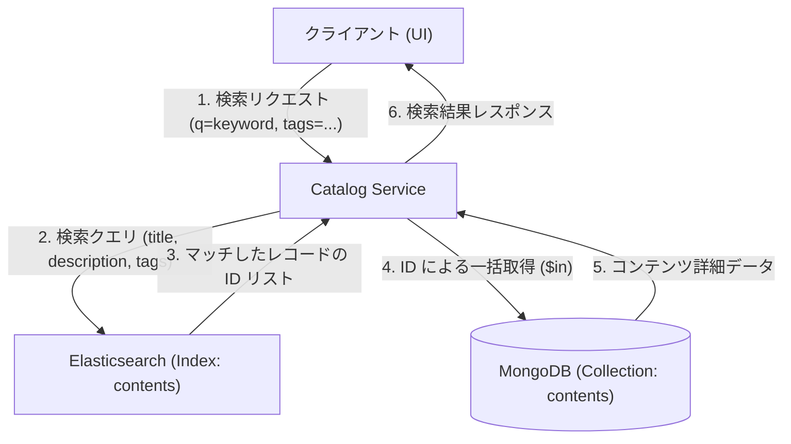

# 検索機能設計 (Search Feature Design)

## 1. 概要
本ドキュメントでは、Elasticsearch と MongoDB を組み合わせたコンテンツ検索機能の設計を定義する。
タイトル、概要（説明文）、およびタグを対象とした高速かつ柔軟な検索を実現する。

## 2. 検索アーキテクチャ
検索クエリの処理には **Elasticsearch** を使用し、検索結果の完全なデータ取得には **MongoDB** を使用する「Sidecar Search」パターンを採用する。

### 2.1 データフロー



### 2.2 なぜこの構成にするのか
- **Elasticsearch**: 全文検索、日本語解析（Kuromoji）、重み付け、サジェストなどの高度な検索機能に優れている。
- **MongoDB**: 非正規化されたドキュメントの高速な取得に優れており、すでにカタログ表示用のマスター（キャッシュ）として機能している。
- **分離のメリット**: ES のインデックスには検索に必要な最小限のフィールドのみを持たせることでインデックスサイズを節約し、データ更新時の負荷を軽減できる。

## 3. データ同期 (Write Path)
**Redpanda Connect (Benthos)** を使用して、PostgreSQL から Elasticsearch および MongoDB へデータを同期する。

- **同期元**: PostgreSQL `content_sync_view`
- **同期先**: 
    - MongoDB: `contents` コレクション (完全なドキュメント)
    - Elasticsearch: `contents` インデックス (検索用フィールドのみ)

## 4. Elasticsearch インデックス設計

### 4.1 インデックス定義 (`contents`)

| フィールド名 | 型 | 用途 |
| :--- | :--- | :--- |
| `id` | keyword | MongoDB との紐付け用 (UUID) |
| `short_id` | keyword | URL 用 ID |
| `title` | text | タイトル検索 (要日本語アナライザー) |
| `description` | text | 概要検索 (要日本語アナライザー) |
| `tags` | keyword | タグによるフィルタリング/検索 |
| `updated_at` | date | ソート/同期管理用 |

### 4.2 日本語解析の設定
`kuromoji` アナライザーを使用し、日本語の単語分割と正規化を行う。

```json
{
  "settings": {
    "analysis": {
      "analyzer": {
        "ja_analyzer": {
          "type": "custom",
          "tokenizer": "kuromoji_tokenizer",
          "filter": ["kuromoji_baseform", "kuromoji_part_of_speech", "cjk_width", "stop", "kuromoji_stemmer", "lowercase"]
        }
      }
    }
  },
  "mappings": {
    "properties": {
      "title": { "type": "text", "analyzer": "ja_analyzer" },
      "description": { "type": "text", "analyzer": "ja_analyzer" },
      "tags": { "type": "keyword" }
    }
  }
}
```

## 5. Catalog Service 実装詳細

### 5.1 検索ロジック
`Catalog Service` (Go) は以下の手順で検索を実行する。

1. **ES 検索**: 
   - `multi_match` クエリを使用して `title` と `description` を検索。
   - `title` に高いベースブースト（例: `^3`）を設定。
   - `tags` が指定されている場合は `bool.filter` または `bool.should` で組み合わせる。
2. **ID 抽出**: ES から返された `hits.hits` から `_id` (または `id` フィールド) を抽出。
3. **Mongo 取得**: MongoDB の `$in` クエリを使用してデータを取得。
4. **順序の再構成**: MongoDB の `$in` は順序を保証しないため、ES が返したランク順にデータを並べ替えてからレスポンスを生成する。

### 5.2 インターフェース変更
- `CatalogRepository` インターフェースに `SearchWithES(query string, tags []string) ([]*CatalogContent, error)` を追加。
- 既存の `Search` (Mongo Regex版) は非推奨とするか、フォールバック用に残す。

## 6. 検討事項 (Future Work)
- **サジェスト機能**: ユーザーの入力中にタイトル候補を出す `completion` フィールドの追加。
- **ペーフィネーション**: ES の `from`/`size` に合わせた Mongo 取得の最適化。
- **重み付けの調整**: 特定のタグを持つコンテンツを上位に表示するなどのランキング調整。
