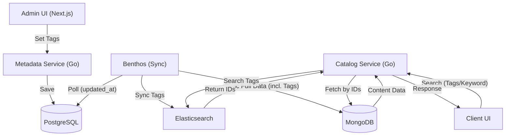

# タグ機能設計 (Tagging Feature Design)

## 1. 概要
本ドキュメントでは、動画およびギャラリーコンテンツに対してタグを付与し、検索や分類に活用するためのタグ機能の設計を定義する。

## 2. 要件
- Adminページにて、動画に対して自由入力で複数個のタグを付与できる。
- タグ情報はPostgreSQLに保存される。
- Benthosを用いてPostgreSQLからElasticsearchにタグ情報を同期する。
- MongoDBはカタログ表示用のデータ取得に使用し、Elasticsearchは検索用に使用する。
- 検索時はESでIDのみを抽出し、そのIDを用いてMongoDBから実データを取得してクライアントに返却する（詳細は [014_service_search_design.md](file:///Users/watanabekouhei/workspace/pechka/stream/docs/014_service_search_design.md) を参照）。

## 3. アーキテクチャ・データフロー

## 4. データベース設計

### 4.1 PostgreSQL (Master)
管理を簡略化するため、正規化せず `videos` および `galleries` テーブルに直接タグを保持する。

**`videos` / `galleries` (既存テーブルへの追加)**
- `tags` (TEXT[]) - タグの配列。内部的には `{"tag1", "tag2"}` 形式で保存。文字列のカンマ区切りでも良いが、Postgresの配列型を使用することでGoの `[]string` との親和性を高める。

> [!NOTE]
> ユーザーの要望通り、検索は Elasticsearch に委ねるため、PostgreSQL 側ではリレーションを持たないシンプルな構成とする。

### 4.2 Elasticsearch (Search Index)
検索に必要な最小限のデータのみを同期する。

**`contents` Index**
- `id` (Keyword) - UUID
- `short_id` (Keyword)
- `title` (Text, Analyzer: standard/kuromoji)
- `tags` (Keyword, Array) - タグの配列
- `updated_at` (Date)

### 4.3 MongoDB (Catalog Cache)
カタログ表示用にタグの配列を含める。

**`ContentCatalog` Collection**
- `_id` (UUID string)
- `tags` (Array of Strings) - 例: `["Sci-Fi", "Action"]`
- (その他の既存フィールド: title, description, assets, metadata...)

## 5. 実装詳細

### 5.1 Metadata Service (Admin API)
- `PUT /api/metadata/v1/admin/metadata/videos/:id` などの更新APIを拡張し、`tags` (string array) を受け取れるようにする。
- 内部的には `tags` カラムを更新する。
- 更新時は `videos` テーブルの `updated_at` を更新し、Benthosが検知できるようにする。

### 5.2 Benthos (Synchronization)
- `content_sync_view` を拡張し、タグを JSON 配列として取得できるようにする (`array_agg`)。
- `benthos.yaml` に Elasticsearch 出力設定を追加する。
- MongoDB への同期時も、タグ情報を含めるようにマッピングを修正する。

### 5.3 Catalog Service (Search API)
- `GET /api/v1/catalog/search?q=...&tags=...` エンドポイントを実装・拡張する。
- 実装詳細は [014_service_search_design.md](file:///Users/watanabekouhei/workspace/pechka/stream/docs/014_service_search_design.md) を参照。

### 5.4 Frontend
- **Admin**: タグの自由入力（チップ形式など）を実装。
- **Detail**: 動画詳細画面にタグを表示。
- **Search**: タグによる絞り込みUIを検討。
